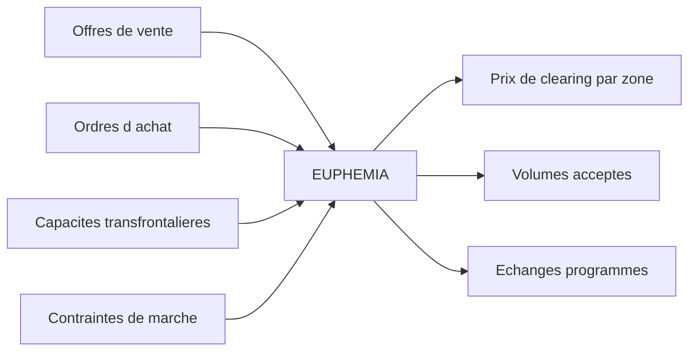
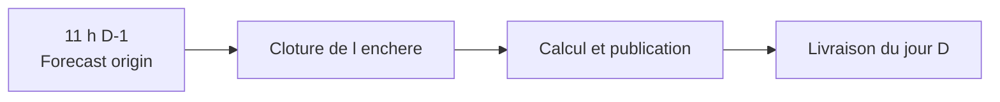
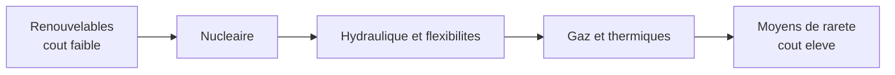
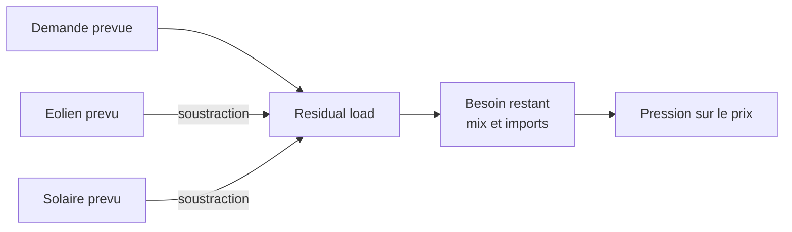

# Fondamentaux du marché day-ahead français

## Objectif

Cette note explique le mécanisme économique que le modèle doit apprendre et transforme ces mécanismes en hypothèses vérifiables. Elle couvre la période horaire de la V1, du 1er janvier 2022 au 30 septembre 2025.

## 1. Fonctionnement du day-ahead

Le marché day-ahead organise le jour D-1 l'achat et la vente d'électricité pour livraison le jour D. Les acteurs soumettent des ordres par période de livraison. Le Single Day-Ahead Coupling traite les offres, les demandes et les capacités transfrontalières avec l'algorithme EUPHEMIA. Ses résultats comprennent les prix de clearing zonaux, les volumes acceptés, les échanges programmés et les positions nettes.

Le prix français dépend donc de l'équilibre français, mais aussi des pays couplés et des capacités d'interconnexion.



### Chronologie du projet



La règle opérationnelle est : une donnée peut être utilisée seulement si elle était disponible au forecast origin. L'heure de clôture applicable à chaque date devra être conservée dans le registre des sources.

## 2. Merit order et prix marginal

Le merit order classe, dans une représentation simplifiée, les moyens disponibles selon leur coût variable ou leur prix d'offre croissant. La demande résiduelle coupe la courbe d'offre ; l'offre marginale nécessaire à l'équilibre donne l'intuition du prix de clearing.



Cette représentation ne reproduit pas exactement EUPHEMIA. Les ordres complexes, contraintes techniques, interconnexions et stratégies de portefeuille peuvent éloigner le prix d'un simple coût de centrale.

Pour une centrale à gaz :

```text
cout marginal ~= prix du gaz / rendement
                + facteur d emission x prix du CO2
                + cout variable d exploitation
```

Gaz et CO2 sont donc des drivers plausibles, surtout lorsque le thermique est marginal.

## 3. Residual load

```text
residual_load = demand_forecast - wind_forecast - solar_forecast
```

Pour le benchmark opérationnel, les trois composantes doivent être des prévisions publiées avant l'enchère. Les valeurs réalisées servent uniquement au diagnostic.



Un residual load faible crée généralement une pression baissière. Un niveau élevé peut nécessiter des moyens coûteux ou des imports. La relation devrait être non linéaire et plus raide en situation de rareté.

## 4. Drivers à tester

| Driver | Mécanisme | Effet attendu | Donnée opérationnelle |
|---|---|---:|---|
| Demande | Davantage de moyens appelés | Positif | Forecast pré-enchère |
| Éolien | Réduit le besoin restant | Négatif | Forecast de production |
| Solaire | Réduit surtout les prix diurnes | Négatif | Forecast de production |
| Disponibilité nucléaire | Une baisse resserre l'offre | Négatif pour la disponibilité | Information connue avant l'enchère |
| Gaz | Renchérit les moyens thermiques | Positif selon le régime | Dernier prix disponible |
| CO2 | Renchérit la production carbonée | Positif selon le régime | Dernier prix disponible |
| Température | Affecte chauffage et climatisation | Non linéaire | Forecast météo archivé |
| Interconnexions | Permettent imports ou exports | Ambigu | Capacité connue |

Ces signes sont des hypothèses économiques, pas des contraintes imposées au modèle.

## 5. Prix négatifs

Les prix peuvent devenir négatifs lorsque la production dépasse largement la demande et que le surplus ne peut pas être suffisamment modulé, stocké ou exporté. Certaines unités peuvent préférer continuer à produire en raison de contraintes ou coûts d'arrêt et de redémarrage.

Ils ne sont pas supprimés comme outliers. L'EDA vérifiera notamment si les périodes négatives présentent un residual load faible, davantage de renouvelables et une concentration horaire ou saisonnière.

## 6. Spikes

Un spike est défini par un quantile du train, par exemple 95 % ou 99 %, ensuite figé. Il peut résulter d'une combinaison de demande élevée, faibles renouvelables, moindre disponibilité nucléaire, interconnexions saturées et combustibles coûteux.

Les spikes sont rares mais peuvent dominer la RMSE. Leur fréquence, MAE, RMSE et contribution à l'erreur quadratique totale seront donc publiées séparément.

## 7. Hypothèses pour l'EDA

1. Le prix augmente avec le residual load, de façon non linéaire.
2. Une faible disponibilité nucléaire accentue cette relation.
3. Les prix négatifs coïncident avec faible demande et renouvelables élevés.
4. Les spikes combinent plusieurs signaux de tension.
5. L'effet du gaz et du CO2 est plus marqué lorsque le thermique est marginal.
6. Les relations changent entre la crise énergétique de 2022 et les années suivantes.

## 8. Limites

- Le merit order est une simplification pédagogique.
- Une corrélation ne prouve pas une causalité.
- Les données réalisées expliquent le système mais ne prouvent pas une performance tradable.
- Le prix zonal ne décrit pas toutes les contraintes internes au réseau français.
- Les résultats horaires ne s'extrapolent pas directement au marché 15 minutes postérieur au 30 septembre 2025.

## 9. Validation de l'étape 1

L'étape est validée si le projet peut expliquer le day-ahead et le couplage européen, les limites du merit order, le residual load sans leakage, la logique des prix négatifs et des spikes, et les hypothèses que l'EDA devra tester.

## Sources officielles

- [ENTSO-E — Single Day-Ahead Coupling](https://www.entsoe.eu/network_codes/cacm/implementation/sdac/)
- [RTE — Économie du système électrique](https://assets.rte-france.com/prod/public/2024-07/BP2023-chapitre9-Economie-systeme-electrique.pdf)
- [RTE — Prix négatifs de l'électricité](https://www.rte-france.com/bases-electricite/consommation-electricite/prix-negatifs-electricite)
- [RTE — Bilan électrique 2025, prix](https://analysesetdonnees.rte-france.com/bilan-electrique-2025/prix)
- [ACER — Key developments in European electricity and gas markets](https://www.acer.europa.eu/monitoring/electricity-gas-key-developments-2026)

Sources consultées le 14 septembre 2026.
